# 🌍 TripBuddy — AI-Powered Travel Planning Platform

<div align="center">

A **full-stack, cross-platform travel planning application** built with **Kotlin Multiplatform (KMP)** and a **Spring Boot** backend — enabling users to search flights, trains & hotels, build smart itineraries, and manage trips across Android, iOS, and Desktop from a single shared codebase.

[](https://kotlinlang.org)
[](https://www.jetbrains.com/lp/compose-multiplatform/)
[](https://spring.io/projects/spring-boot)
[](https://firebase.google.com)
[](https://render.com)
[](https://aiven.io)

</div>

---

## 🚀 Try the App

> 👉 **[Download the APK](https://limewire.com/d/Wc8Jf#XyotwZkBFR)**

---

## 📑 Table of Contents

- [Overview](#-overview)
- [Architecture](#-architecture)
- [Features](#-features)
- [Tech Stack](#-tech-stack)
- [Screenshots](#-screenshots)
- [API Endpoints](#-api-endpoints)
- [Project Structure](#-project-structure)
- [Getting Started](#-getting-started)
- [Environment Variables](#-environment-variables)
- [Deployment](#-deployment)
- [Contributors](#-contributors)
- [Acknowledgments](#-acknowledgments)
- [Contact](#-contact)

---

## 🔭 Overview

**TripBuddy** is a production-grade travel planning platform designed to simplify every step of a trip — from discovering destinations and booking transportation, to building day-by-day itineraries and exporting them as PDFs.

### Why TripBuddy?

| Problem | TripBuddy's Solution |
|---|---|
| Juggling between multiple apps for flights, trains, hotels | **Unified multi-modal transport search** — flights (Amadeus), trains (Indian Railways DB), buses — all in one place |
| No cohesive trip planning experience | **Smart itinerary builder** with activities, meals, cost breakdown, and notes |
| Platform lock-in (Android-only or iOS-only) | **Kotlin Multiplatform** — single codebase targets Android, iOS, and Desktop |
| Fragmented destination research | **City discovery** with Wikipedia summaries, Unsplash photos, Foursquare POIs, and weather data |
| Losing trip details after booking | **Trip history & PDF export** — save, review, and share all your trips |

---

## 🏗 Architecture

```
┌──────────────────────────────────────────────────────────────────┐
│                        CLIENT (KMP)                              │
│  ┌─────────────┐  ┌──────────────┐  ┌─────────────────────────┐ │
│  │   Android    │  │     iOS      │  │       Desktop           │ │
│  │  (Primary)   │  │  (Planned)   │  │      (Planned)          │ │
│  └──────┬───────┘  └──────┬───────┘  └───────────┬─────────────┘ │
│         └──────────────────┼──────────────────────┘              │
│                    commonMain (Shared)                            │
│         ┌──────────────────┼──────────────────┐                  │
│         │    Compose UI  · ViewModels         │                  │
│         │    Navigation  · Network Layer      │                  │
│         │    Auth · PDF  · Notifications      │                  │
│         └──────────────────┼──────────────────┘                  │
└────────────────────────────┼─────────────────────────────────────┘
                             │ HTTPS (Ktor Client)
                             ▼
┌──────────────────────────────────────────────────────────────────┐
│               BACKEND (Spring Boot 3 — Kotlin/JVM)               │
│  ┌────────────┐  ┌────────────┐  ┌──────────────────┐           │
│  │ Controllers │──│  Services  │──│   Repositories   │           │
│  │  (REST)     │  │ (Business) │  │   (JPA / MySQL)  │           │
│  └────────────┘  └─────┬──────┘  └──────────────────┘           │
│                        │                                         │
│         ┌──────────────┼───────────────────────┐                │
│         ▼              ▼                       ▼                │
│   ┌──────────┐  ┌────────────┐  ┌───────────────────┐          │
│   │ Amadeus  │  │ Foursquare │  │  Wikipedia / OSM   │          │
│   │ Flight   │  │  Places    │  │  Unsplash / Weather│          │
│   │   API    │  │    API     │  │      APIs          │          │
│   └──────────┘  └────────────┘  └───────────────────┘          │
│                                                                  │
│   Database: MySQL (Aiven Cloud)  ·  Deployed on: Render          │
└──────────────────────────────────────────────────────────────────┘
```

### Design Patterns

| Layer | Pattern | Details |
|---|---|---|
| **Frontend** | MVVM + Repository | ViewModels expose state; Repositories abstract network calls |
| **Navigation** | Decompose (component-based) | Type-safe, lifecycle-aware navigation with back-stack management |
| **Backend** | Controller → Service → Repository | Standard Spring Boot layered architecture |
| **DI** | Koin (frontend) · Spring (backend) | Modular dependency injection on both sides |
| **Networking** | Ktor Client (frontend) · RestTemplate + WebFlux (backend) | Async, coroutine-based HTTP on client side |

---

## ✨ Features

### 🎯 Core Features

- **✈️ Flight Search & Booking** — Real-time flight search powered by the **Amadeus API** with filters for cabin class, passengers, and travel dates
- **🚂 Train Search** — Search Indian Railways trains between any two stations with route, timing, and distance data
- **🚌 Bus Search** — Browse inter-city bus options
- **🏨 Hotel Discovery** — Search hotels/accommodations by city with pricing and details
- **🗺️ Destination Discovery** — Explore destinations categorized by Beaches, Mountains, Hill Stations, and Temples
- **📋 Smart Itinerary Builder** — Create detailed trip plans with activities, meals, cost breakdown, and personal notes
- **📍 City Details** — Rich city pages with Wikipedia summaries, Unsplash photos, weather info, and nearby POIs (Foursquare)

### 🚀 Advanced Features

- **🔐 Authentication** — Firebase Auth with Email/Password + Google Sign-In
- **💾 Trip History** — Save completed trips and view past itineraries (per-user, backed by MySQL)
- **📄 PDF Export** — Generate and share trip itineraries as PDF documents
- **🔔 Push Notifications** — Booking confirmations and travel alerts
- **📶 Offline Support** — Dedicated offline screen with graceful error handling via `GenericErrorView`
- **🌐 Network Monitoring** — Intelligent connectivity-aware UI that adapts to network state
- **⭐ Post-Trip Feedback** — Rate and review your travel experiences
- **🎨 Lottie Animations** — Smooth, premium micro-animations throughout the UI
- **👤 Personalized Home** — Greeting by name on the home screen after sign-in

---

## 🛠 Tech Stack

### Frontend — Kotlin Multiplatform + Compose

| Category | Technology | Version |
|---|---|---|
| **Language** | Kotlin | 2.1.21 |
| **UI Framework** | Compose Multiplatform | 1.5.11 |
| **Design System** | Material 3 + Material Icons Extended | 1.2.0 |
| **Navigation** | Decompose (component-based) | 3.1.0 |
| **Supplemental Nav** | PreCompose (ViewModels) | 1.5.7 |
| **HTTP Client** | Ktor (OkHttp engine on Android) | 2.3.12 |
| **Serialization** | Kotlinx Serialization JSON | 1.6.3 |
| **Date/Time** | Kotlinx Datetime | 0.6.0 |
| **Image Loading** | Kamel | 0.9.0 |
| **Animations** | Lottie Compose | 6.3.0 |
| **DI** | Koin | 3.5.3 |
| **Logging** | Kermit (Touchlab) | 2.0.3 |
| **Settings** | Multiplatform Settings | 1.1.1 |
| **Auth** | Firebase Auth KTX + Google Play Services Auth | 22.3.0 / 21.2.0 |
| **Database** | Firebase Firestore KTX | Latest |
| **Graphics** | Skiko | 0.8.12 |
| **Coroutines** | Kotlinx Coroutines | 1.8.1 |

### Backend — Spring Boot (Kotlin/JVM)

| Category | Technology | Version |
|---|---|---|
| **Framework** | Spring Boot | 3.3.4 |
| **Language** | Kotlin (JVM) | 2.0.20 |
| **Java** | OpenJDK | 17 |
| **ORM** | Spring Data JPA + Hibernate | — |
| **Database** | MySQL (Aiven Cloud) | 8.0 |
| **HTTP Clients** | Ktor Client (CIO) + Spring WebFlux | 2.3.10 |
| **Web Scraping** | Selenium + Jsoup | 4.19.1 / 1.17.2 |
| **ML** | Smile Core (SVD model) | 2.6.0 |
| **Serialization** | Jackson + Kotlinx Serialization | — |
| **Containerization** | Docker | OpenJDK 17 Slim |

### External APIs Integrated

| API | Purpose |
|---|---|
| **Amadeus** | Real-time flight search and pricing |
| **Foursquare** | Points of interest & venue discovery |
| **Unsplash** | High-quality destination photographs |
| **Wikipedia** | City/destination summary information |
| **OpenWeather** | Weather data + geocoding |
| **OpenStreetMap / Overpass** | Geographic data & POI mapping |

### Infrastructure

| Component | Provider |
|---|---|
| **Backend Hosting** | Render (Docker container) |
| **Database** | Aiven MySQL Cloud |
| **Authentication** | Firebase Auth |
| **User Data Store** | Firebase Firestore |
| **CI/CD** | Gradle + Docker |

---

## 📱 Screenshots

<div align="center">
  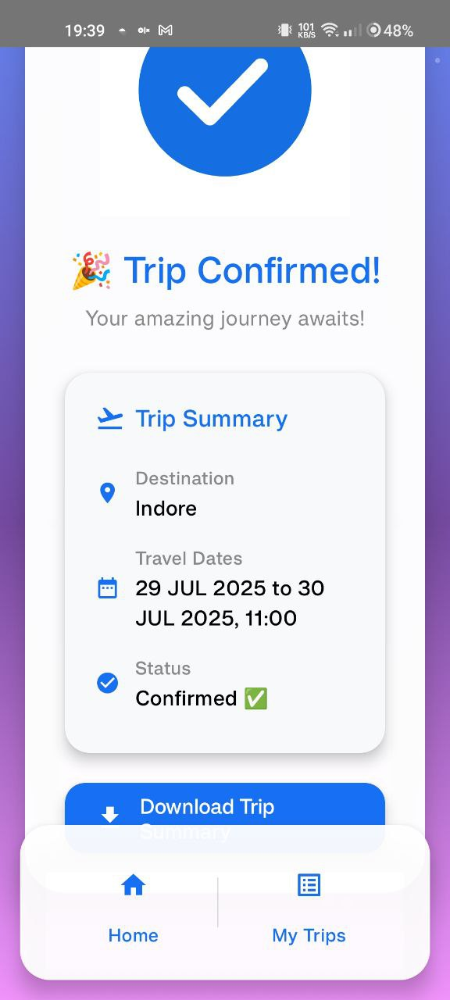
  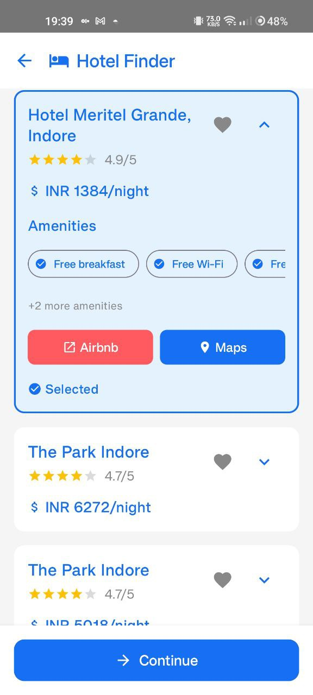
  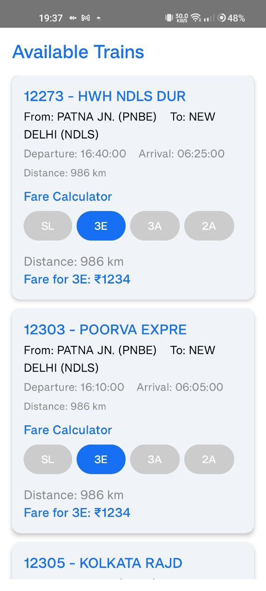
</div>

<div align="center">
  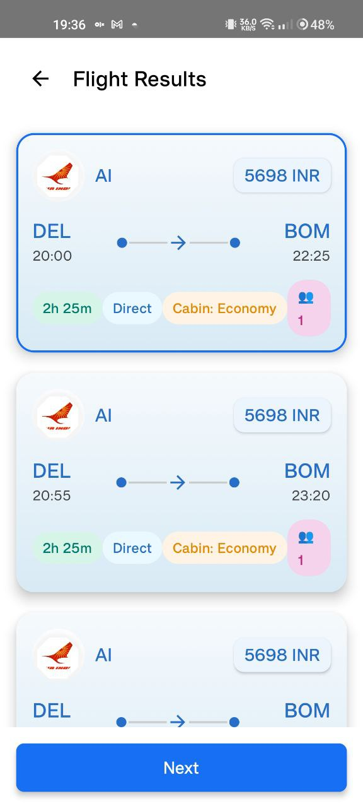
  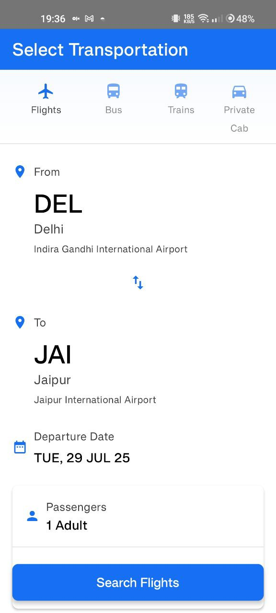
  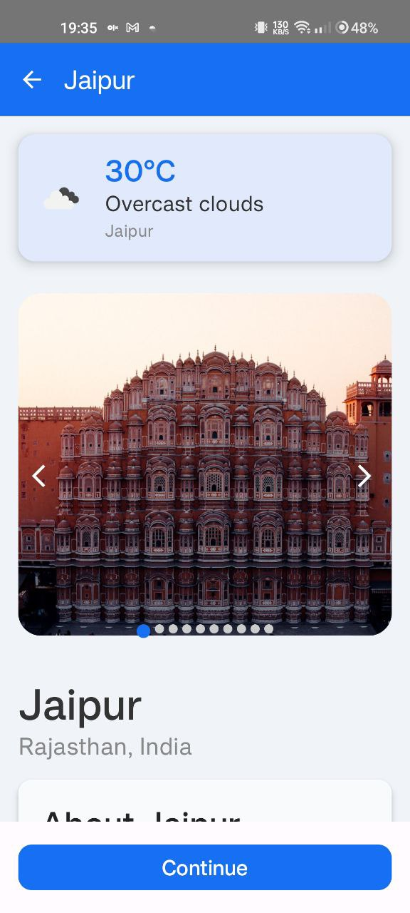
</div>

<div align="center">
  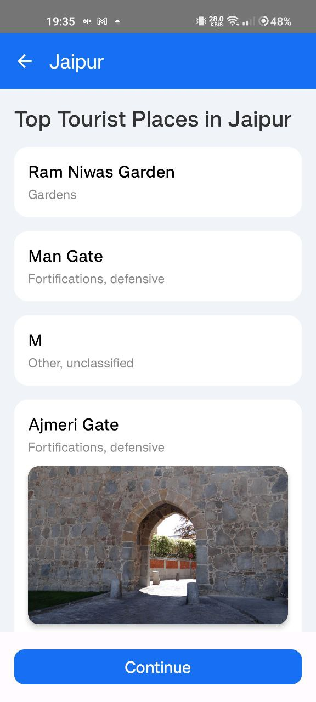
  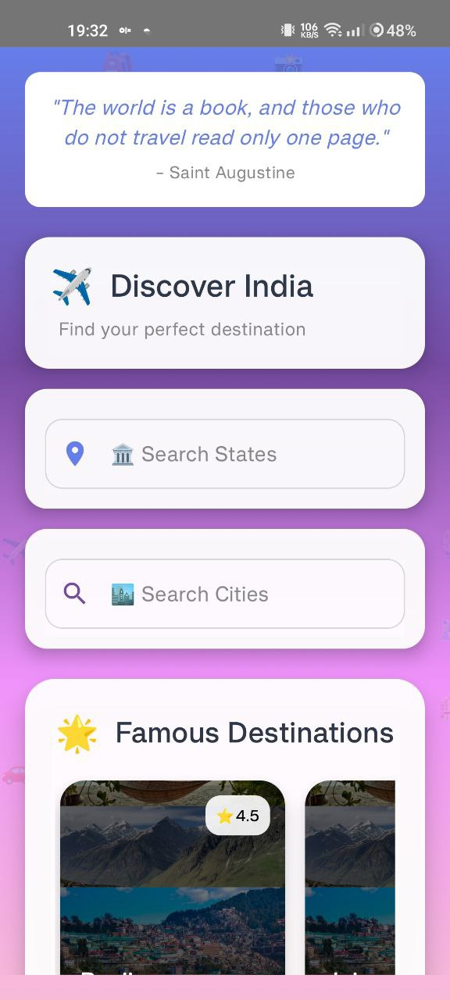
  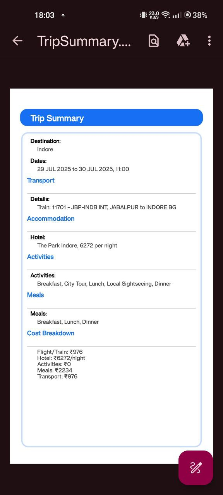
</div>

<div align="center">
  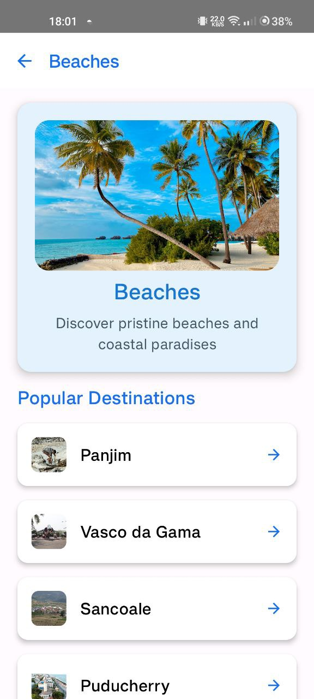
  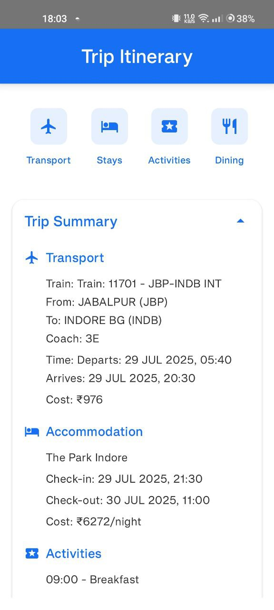
  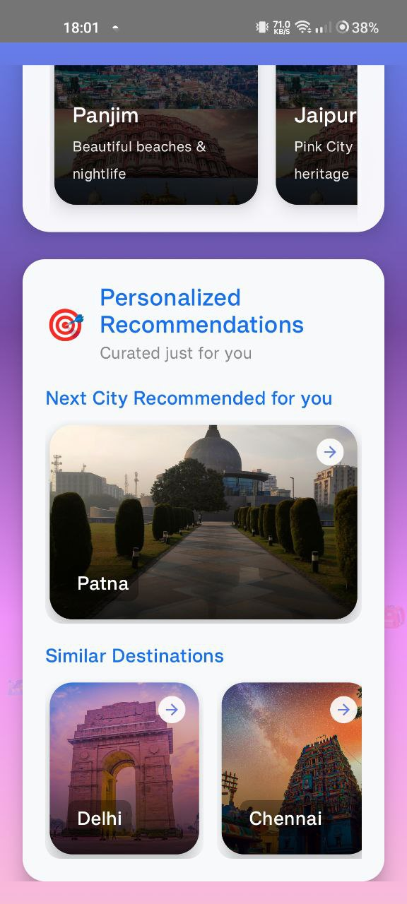
</div>

<div align="center">
  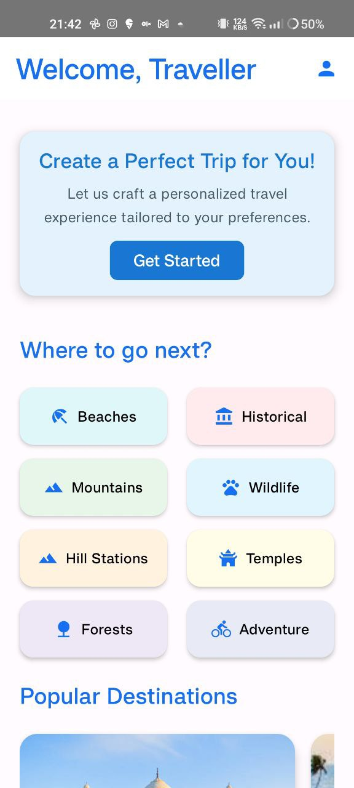
</div>

### 🎯 Key Screens Showcased

| Screen | Highlights |
|---|---|
| **Onboarding** | Animated Lottie introduction with swipe-through pages |
| **Sign In / Sign Up** | Email + Google Sign-In, password visibility toggle, confirmation validation |
| **Home Dashboard** | Personalized greeting, category-based destination discovery (Beaches, Mountains, etc.) |
| **City Search** | Real-time city autocomplete with state/region drill-down |
| **Flight Search** | Multi-passenger, cabin-class selector, date picker, live Amadeus results |
| **Train Search** | Station autocomplete, route search, coach selection with fare calculator |
| **Hotel Selection** | City-based hotel listing with pricing and details |
| **Trip Itinerary** | Day-by-day planner with activities, meals, cost breakdown, and notes |
| **Trip Confirmation** | Summary view with PDF export and share options |
| **My Trips** | Full trip history with detailed past itineraries |
| **Profile** | User info, logout, navigation to trip history |

---

## 📡 API Endpoints

The backend is deployed at: `https://tripbuddyfinalbackend.onrender.com`

### Flights

| Method | Endpoint | Description |
|---|---|---|
| `GET` | `/flights/search` | Search flights (params: `fromCity`, `toCity`, `date`, `adults`, `children`, `infants`, `cabinClass`) |
| `GET` | `/api/airports/cities` | List all cities with airports |

### Trains

| Method | Endpoint | Description |
|---|---|---|
| `GET` | `/api/trains/search` | Search trains between stations (params: `from`, `to`) |
| `GET` | `/api/trains/stations` | Search train stations by name (param: `query`) |

### Hotels & Accommodation

| Method | Endpoint | Description |
|---|---|---|
| `GET` | `/api/hotels` | Search hotels by city (param: `city`) |

### Destinations & Cities

| Method | Endpoint | Description |
|---|---|---|
| `GET` | `/api/destinations` | Search destinations by name (param: `name`) |
| `GET` | `/api/destinations/{id}/details` | Get full city details by ID |
| `GET` | `/api/city-details/by-name` | Get city details by name (param: `name`) |

### Trips

| Method | Endpoint | Description |
|---|---|---|
| `POST` | `/api/trips` | Save a trip (Header: `X-User-Id`; Body: trip details JSON) |
| `GET` | `/api/my-trips` | Get user's trip history (param: `userId`) |

### Discovery

| Method | Endpoint | Description |
|---|---|---|
| `GET` | `/api/dining/**` | Dining/restaurant data |
| `GET` | `/api/experiences/**` | Local experiences and activities |
| `GET` | `/api/foursquare/**` | POI data via Foursquare |

---

## 📁 Project Structure

```
TripBuddy/
├── composeApp/                          # KMP Compose frontend
│   └── src/
│       ├── commonMain/                  # ✅ Shared code (all platforms)
│       │   └── kotlin/.../travel/frontend/
│       │       ├── App.kt              # Root composable & navigation host
│       │       ├── AppSettings.kt      # Persistent user preferences
│       │       ├── Screens/            # All UI screens
│       │       │   ├── HomeScreen.kt
│       │       │   ├── SignInScreen.kt / SignUpScreen.kt
│       │       │   ├── OnboardingScreen.kt
│       │       │   ├── SearchCityScreen.kt
│       │       │   ├── CityDetailsScreen.kt
│       │       │   ├── CategoryDetailsScreen.kt
│       │       │   ├── StateScreen.kt
│       │       │   ├── HotelScreen.kt / HotelForTrainScreen.kt
│       │       │   ├── TripItineraryScreen.kt
│       │       │   ├── TripConfirmationScreen.kt
│       │       │   ├── MyTripsScreen.kt
│       │       │   ├── ProfileScreen.kt
│       │       │   ├── PostTripFeedbackScreen.kt
│       │       │   ├── OfflineScreen.kt
│       │       │   └── Transportation/
│       │       │       ├── FlightSearchScreen.kt
│       │       │       ├── FlightDetailsScreen.kt
│       │       │       ├── TrainSearchScreen.kt
│       │       │       ├── TrainDetailsScreen.kt
│       │       │       └── BusSearchScreen.kt
│       │       ├── viewModel/          # Business logic & state
│       │       │   ├── FlightViewModel.kt / FlightSearchViewModel.kt
│       │       │   ├── CitySearchViewModel.kt / CityDetailViewModel.kt
│       │       │   ├── HotelViewModel.kt
│       │       │   ├── BusSearchViewModel.kt
│       │       │   └── AirportCityViewModel.kt
│       │       ├── network/            # API clients & services
│       │       │   ├── ApiClient.kt    # Base URL + HTTP client
│       │       │   ├── NetworkClient.kt
│       │       │   ├── FlightService.kt
│       │       │   ├── TravelApi.kt
│       │       │   ├── TripService.kt
│       │       │   ├── RecommendationService.kt
│       │       │   └── NetworkMonitor.kt
│       │       ├── navigation/         # Decompose navigation
│       │       │   ├── Screen.kt       # Sealed class of all routes
│       │       │   ├── Root.kt         # Root component
│       │       │   └── RootNavigation.kt
│       │       ├── auth/               # Authentication
│       │       │   ├── AuthService.kt
│       │       │   └── GoogleSignInManager.kt
│       │       ├── model/              # Data models & DTOs
│       │       ├── config/             # API key configuration
│       │       ├── pdf/                # PDF generation
│       │       ├── notification/       # Push notifications
│       │       ├── serialization/      # Custom serializers
│       │       ├── ui/components/      # Reusable UI components
│       │       └── utils/              # Utility functions
│       ├── androidMain/                # Android-specific implementations
│       └── iosMain/                    # iOS-specific implementations
│
├── TripBuddyBackend/                   # Spring Boot backend
│   ├── Dockerfile                      # Docker containerization
│   └── src/main/kotlin/com/example/travel/
│       ├── TravelPlanApplication.kt    # Spring Boot entry point
│       ├── controller/                 # REST API controllers
│       │   ├── FlightController.kt
│       │   ├── TrainController.kt
│       │   ├── HotelController.kt
│       │   ├── CityController.kt
│       │   ├── TripController.kt
│       │   ├── AirportController.kt
│       │   ├── DiningController.kt
│       │   ├── ExperienceController.kt
│       │   ├── FoursquareController.kt
│       │   ├── CityInfoController.kt
│       │   └── UserController.kt
│       ├── service/                    # Business logic
│       │   ├── AmadeusFlightService.kt # Amadeus API integration
│       │   ├── TrainService.kt
│       │   ├── HotelService.kt
│       │   ├── DestinationService.kt
│       │   ├── TripService.kt
│       │   ├── FoursquareService.kt
│       │   ├── GeocodingService.kt
│       │   ├── WikipediaService.kt
│       │   ├── UnsplashService.kt
│       │   ├── DiningService.kt
│       │   ├── ExperienceService.kt
│       │   └── AirportService.kt
│       ├── repository/                 # Data access (JPA)
│       ├── model/                      # JPA entities
│       ├── dto/                        # Data transfer objects
│       ├── network/                    # External API clients
│       │   ├── FlightApiClient.kt
│       │   ├── FoursquareApiClient.kt
│       │   ├── HotelApiClient.kt
│       │   ├── OverpassApiClient.kt
│       │   └── OpenTripMapService.kt
│       └── exception/                  # Global exception handling
│
├── iosApp/                             # iOS app wrapper
├── gradle/libs.versions.toml           # Version catalog
├── build.gradle.kts                    # Root build config
└── settings.gradle.kts                 # Module settings
```

---

## 🚀 Getting Started

### Prerequisites

| Tool | Version | Purpose |
|---|---|---|
| **Android Studio** | Ladybug+ | IDE with KMP support |
| **JDK** | 17 | Backend compilation |
| **Kotlin** | 2.1.21 | Frontend language |
| **Gradle** | 8.x | Build system |
| **Docker** | Latest | Backend containerization (optional) |
| **MySQL** | 8.0 | Local database (or use Aiven) |

### 1️⃣ Clone the Repository

```bash
git clone https://github.com/abhishek130904/iitiSoC.git
cd iitiSoC
```

### 2️⃣ Frontend Setup (Android)

```bash
# 1. Open the project in Android Studio
# 2. Let Gradle sync complete

# 3. Create local.properties in the project root with:
sdk.dir=<YOUR_ANDROID_SDK_PATH>
unsplash.api.key=<YOUR_UNSPLASH_API_KEY>
recommendation.base.url=<YOUR_RECOMMENDATION_SERVICE_URL>

# 4. Add google-services.json to composeApp/ (from Firebase Console)

# 5. Run on Android emulator or device
./gradlew :composeApp:installDebug
```

### 3️⃣ Backend Setup

```bash
cd TripBuddyBackend

# Option A: Run locally with Gradle
./gradlew bootRun

# Option B: Run with Docker
docker build -t tripbuddy-backend .
docker run -p 8080:8080 \
  -e DB_URL="jdbc:mysql://<host>:<port>/<db>" \
  -e DB_USERNAME="<username>" \
  -e DB_PASSWORD="<password>" \
  -e amadeus_key="<your_amadeus_key>" \
  -e amadeus_sec="<your_amadeus_secret>" \
  -e rapid="<your_rapidapi_key>" \
  -e open="<your_openweather_key>" \
  -e unsplash="<your_unsplash_key>" \
  -e foursquare="<your_foursquare_key>" \
  tripbuddy-backend
```

The backend starts on `http://localhost:8080`.

---

## 🔑 Environment Variables

### Backend (`application.properties` / env vars)

| Variable | Description |
|---|---|
| `DB_URL` | MySQL JDBC connection URL (e.g., Aiven cloud) |
| `DB_USERNAME` | Database username |
| `DB_PASSWORD` | Database password |
| `amadeus_key` | Amadeus API key for flight search |
| `amadeus_sec` | Amadeus API secret |
| `rapid` | RapidAPI key |
| `open` | OpenWeather API key |
| `open_geourl` | OpenWeather geocoding endpoint |
| `openurl` | OpenWeather weather endpoint |
| `unsplash` | Unsplash API access key |
| `foursquare` | Foursquare API key |

### Frontend (`local.properties`)

| Property | Description |
|---|---|
| `unsplash.api.key` | Unsplash client ID (injected via BuildConfig) |
| `recommendation.base.url` | Recommendation service base URL |

---

## 🐳 Deployment

### Backend Deployment (Render)

The backend is containerized with Docker and deployed on **Render**:

1. Push to the GitHub repository
2. Render auto-builds from the `Dockerfile`
3. Environment variables are configured in the Render dashboard
4. The app is served at `https://tripbuddyfinalbackend.onrender.com`

### Database (Aiven)

- **Provider**: Aiven MySQL Cloud
- **Auto-migration**: Spring JPA with `ddl-auto=update` — schema changes are applied automatically on boot

### Android Release

```bash
# Build a signed APK
./gradlew :composeApp:assembleRelease
```

---

## 👨‍💻 Contributors

| Name | Role |
|---|---|
| **Abhishek Raj** | Full-Stack Developer — Architecture, Backend, Frontend |
| **Purvi Jain** | Frontend Developer |
| **Shrawani Palange** | Frontend Developer |

---

## 🙏 Acknowledgments

- **[JetBrains](https://www.jetbrains.com/)** — Kotlin Multiplatform & Compose Multiplatform
- **[Google](https://developer.android.com/)** — Jetpack Compose, Firebase, Material Design
- **[Amadeus](https://developers.amadeus.com/)** — Flight search API
- **[Foursquare](https://foursquare.com/)** — Places & POI data
- **[Unsplash](https://unsplash.com/)** — Destination photography
- **[Ktor](https://ktor.io/)** — Kotlin-native HTTP framework
- **[Decompose](https://arkivanov.github.io/Decompose/)** — Component-based navigation
- **[Lottie](https://airbnb.design/lottie/)** — Beautiful animations
- **[Aiven](https://aiven.io/)** — Managed cloud database

---

## 📞 Contact

- **Email**: rajabhishek4444@gmail.com
- **LinkedIn**: [Abhishek Raj](http://www.linkedin.com/in/abhishekraj-iiti)

---

<div align="center">

⭐ **Star this repository if you find it helpful!**

**Made with ❤️ using Kotlin Multiplatform**

</div>
