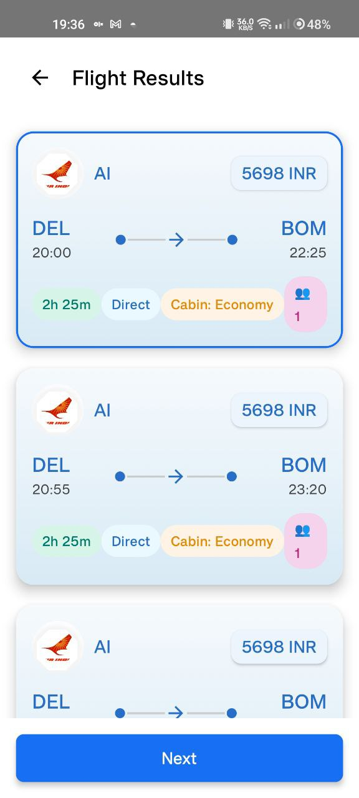

# 🌍 Trip Buddy - Travel Planning App

A comprehensive travel planning application built with **Kotlin Multiplatform** that provides seamless cross-platform support for Android, iOS, and Desktop platforms.


## 🚀 Try the App
Click the link below to use the app:  
👉 [Download / Access App](https://limewire.com/d/Wc8Jf#XyotwZkBFR)

---

## 👨‍💻 Contributors
- **Abhishek Raj**  
- **Purvi Jain**  
- **Shrawani Palange**

---
## 📱 Features

### 🎯 Core Functionality
- **Multi-transportation Booking**: Search and book flights, trains, buses.
- **Accommodation Search**: Find hotels and accommodations by city with detailed information
- **Smart Trip Planning**: Create comprehensive itineraries with activities, meals, and transportation
- **Destination Discovery**: Explore destinations by categories (Beaches, Mountains, Hill Stations, Temples)
- **Real-time Search**: Live flight and train availability with detailed schedules
- **Trip Management**: Save trip history and manage multiple travel plans
- **Post-trip Feedback**: Rate and review your travel experiences

### 🚀 Advanced Features
- **Offline Support**: Access saved trips and essential features without internet
- **PDF Generation**: Export trip details as PDF for easy sharing
- **Push Notifications**: Stay updated with booking confirmations and travel alerts
- **User Authentication**: Secure login with Firebase Auth and Google Sign-In
- **Responsive UI**: Material 3 design with smooth animations using Lottie
- **Network Monitoring**: Intelligent handling of connectivity issues

## 🛠️ Tech Stack

### Frontend
- **UI Framework**: Jetpack Compose Multiplatform
- **Design System**: Material 3 with custom theming
- **Animations**: Lottie for smooth user interactions
- **Navigation**: Decompose for clean architecture navigation
- **Image Loading**: Kamel for efficient image handling

### Backend Integration
- **HTTP Client**: Ktor with CIO engine
- **Serialization**: Kotlinx Serialization JSON
- **Authentication**: Firebase Auth with Google Sign-In
- **Database**: Firebase Firestore for user data
- **API Integration**: RESTful APIs for travel services

### Architecture
- **Architecture Pattern**: MVVM with Repository pattern
- **Dependency Injection**: Koin for modular architecture
- **State Management**: Compose State with ViewModels
- **Coroutines**: Kotlin Coroutines for async operations
- **Settings**: Multiplatform Settings for user preferences

### Development Tools
- **Language**: Kotlin 2.1.21
- **Build System**: Gradle with Kotlin DSL
- **Version Catalog**: Centralized dependency management
- **Testing**: JUnit for unit testing

## 📁 Project Structure

```
iitiSoC/
├── composeApp/
│   ├── src/
│   │   ├── commonMain/          # Shared code across platforms
│   │   │   ├── kotlin/
│   │   │   │   └── org/example/project/travel/
│   │   │   │       ├── frontEnd/
│   │   │   │       │   ├── Screens/              # UI Screens
│   │   │   │       │   │   ├── Transportation/   # Transport booking screens
│   │   │   │       │   │   └── ...
│   │   │   │       │   ├── network/              # API clients and services
│   │   │   │       │   ├── auth/                 # Authentication services
│   │   │   │       │   ├── model/                # Data models and DTOs
│   │   │   │       │   ├── viewModel/            # Business logic
│   │   │   │       │   ├── navigation/           # Navigation components
│   │   │   │       │   ├── pdf/                  # PDF generation
│   │   │   │       │   ├── notification/         # Push notifications
│   │   │   │       │   └── utils/                # Utility functions
│   │   │   │       └── ...
│   │   │   └── composeResources/ # Shared resources
│   │   ├── androidMain/         # Android-specific code
│   │   ├── iosMain/            # iOS-specific code
│   │   └── desktopMain/        # Desktop-specific code
│   └── build.gradle.kts
├── iosApp/                     # iOS application wrapper
├── gradle/
└── README.md
```

## 📱 Screenshots

<div align="center">
  
  
  
</div>

<div align="center">
  
  
  
</div>

<div align="center">
  
  
  
</div>

<div align="center">
  
  
  
</div>

<div align="center">
  
</div>

### 🎯 Key Features Showcased
- **Onboarding Experience**: Beautiful animated introduction screens
- **Authentication**: Secure login and signup with Google integration
- **Home Dashboard**: Category-based destination discovery
- **Smart Search**: Real-time flight and accommodation search
- **Trip Planning**: Comprehensive itinerary creation and management
- **User Profile**: Personalized user experience and trip history

## 🙏 Acknowledgments

- **JetBrains** for Kotlin Multiplatform
- **Google** for Jetpack Compose and Firebase
- **Ktor Team** for the excellent HTTP client
- **Material Design** for the design system
- **Lottie** for beautiful animations

## 📞 Contact
- **Email**: rajabhishek4444@gmail.com
- **LinkedIn**: [Abhishek Raj](https://linkedin.com/in/yourprofile](http://www.linkedin.com/in/abhishekraj-iiti)


---

⭐ **Star this repository if you find it helpful!**

**Made with ❤️ using Kotlin Multiplatform**
